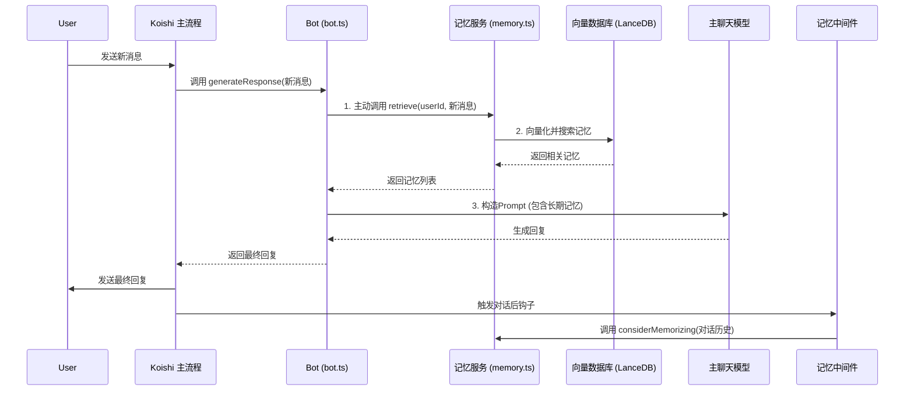

# 动态长期记忆系统设计文档

本文档详细描述了为 Koishi 机器人设计和实现一个基于向量数据库的动态长期记忆系统的完整方案。

## 1. 核心目标

为机器人集成一个智能的、基于向量数据库的长期记忆系统。该系统能够智能判断对话价值，将关键信息处理后存入本地向量数据库，并在未来对话中主动检索和利用这些记忆，以实现更具个性化和上下文感知能力的交互。

## 2. 架构设计与数据流

系统采用服务主动调用与中间件被动触发相结合的模式，确保了模块职责清晰和低耦合。

### 2.1. 架构流程图



### 2.2. 数据流解释

1.  **记忆检索 (主动调用)**:
    *   当 `Bot` 类处理新消息时，它会主动调用 `MemoryService` 提供的 `retrieve()` 方法。
    *   `MemoryService` 将查询文本向量化，并在 LanceDB 中根据用户ID过滤，搜索最相关的记忆。
    *   `Bot` 类接收到记忆列表后，自行将其整合到主聊天模型的系统提示词中。

2.  **记忆存储 (被动触发)**:
    *   一次完整的对话（用户提问、AI回答）结束后，一个独立的 Koishi 中间件会被触发。
    *   该中间件调用 `MemoryService` 的 `considerMemorizing()` 方法，传入刚刚发生的对话历史。
    *   服务内部依次调用**决策模型**和**摘要模型**，并将最终的记忆摘要向量化后存入 LanceDB。

## 3. 技术栈选型

*   **AI 模型**: 全面采用 Google Gemini 生态系统。
    *   **文本嵌入**: `embedding-001`
    *   **决策与摘要**: `gemini-1.5-flash` (兼顾性能与成本)
*   **向量数据库**: **LanceDB**。
    *   **理由**: 纯本地文件数据库，无需独立部署服务，作为库直接集成，轻量且高效。
*   **核心依赖库**:
    *   `lancedb`: LanceDB 官方 Node.js 客户端。
    *   `axios`: 用于与 Gemini API 进行 HTTP 通信。
    *   `zod`: (推荐) 用于验证和解析从 API 返回的 JSON 对象，增强系统健壮性。

## 4. 配置文件设计 (`koishi.config.ts`)

在 `memory` 插件的配置中，提供对所有外部服务和关键参数的灵活配置。

```typescript
// 示例配置
const config = {
  plugins: {
    'memory': {
      // 1. Embedding 模型配置
      embedding: {
        APIType: 'Gemini', 
        APIKey: 'your-google-ai-api-key', 
        EmbeddingModel: 'embedding-001', 
        BaseURL: 'https://generativelanguage.googleapis.com/v1beta/models/embedding-001:embedContent',
        EmbeddingDims: 768,
        ChunkSize: 300,
      },
      
      // 2. 决策模型配置
      decisionModel: {
        endpoint: 'https://generativelanguage.googleapis.com/v1beta/models/gemini-1.5-flash:generateContent',
        apiKey: 'your-google-ai-api-key',
        model: 'gemini-1.5-flash',
        prompt: `
          Analyze the following conversation and determine if it contains critical information worth remembering for the long term. 
          Critical information includes user preferences, facts, appointments, plans, or relationships.
          Respond with ONLY a valid JSON object.
          If the information is important, respond with: {"should_remember": true, "reason": "A brief explanation of why."}
          If the conversation is trivial or small talk, respond with: {"should_remember": false}

          Conversation:
          {conversation}
        `,
        generationConfig: {
          "response_mime_type": "application/json",
        }
      },

      // 3. 摘要模型配置
      summarizerModel: {
        endpoint: 'https://generativelanguage.googleapis.com/v1beta/models/gemini-1.5-flash:generateContent',
        apiKey: 'your-google-ai-api-key',
        model: 'gemini-1.5-flash',
        prompt: `
          Summarize the following conversation into a single, concise, and complete statement from a third-person perspective.
          For example: "The user's birthday is on October 25th."

          Conversation:
          {conversation}

          Summary:
        `,
      },

      // 4. 向量数据库配置
      vectorStore: {
        path: './data/lancedb', // LanceDB 数据库文件存放路径
        tableName: 'memories',  // 表名
      },

      // 5. 记忆检索配置
      retrieval: {
        topK: 3, // 每次检索返回最相关的3条记忆
      }
    }
  }
}
```

## 5. 关键代码实现结构

*   **`packages/core/src/embeddings/gemini.ts`**:
    *   新增 `GeminiEmbedding` 类，继承自 `EmbeddingBase`。
    *   实现 `embed()` 和 `embedMany()` 方法，封装与 Gemini Embedding API 的通信逻辑。

*   **`packages/memory/src/vectorStore.ts`**:
    *   实现 `LanceDBVectorStore` 类。
    *   内部包含一个状态机 (`uninitialized`, `ready`, `failed`) 作为**熔断器**，处理本地 I/O 失败。
    *   提供 `init()`, `addMemory()`, `search()` 等核心方法。

*   **`packages/memory/src/index.ts`**:
    *   实现 `Memory` 核心服务。
    *   提供一个**公开的 `retrieve()` 方法**供 `Bot` 类调用。
    *   通过**中间件 `postDialogueMiddleware`** 实现对话结束后的记忆存储流程。
    *   包含 `considerMemorizing()` 和 `summarizeMemory()` 业务逻辑，并通过 `callGeminiAPI` 辅助函数与外部 LLM 通信。

*   **`packages/core/src/bot.ts`**:
    *   在 `generateResponse()` 方法的起始阶段，**主动调用 `this.ctx.memory.retrieve()`** 来获取长期记忆。
    *   将返回的记忆列表格式化后，注入到最终的系统提示词中。

## 6. 健壮性设计：错误处理与降级策略

系统设计充分考虑了外部依赖失败的情况，确保主聊天功能不受影响。

*   **网络 API 调用失败**:
    *   **检索时**: 若 Embedding API 失败，`memory.retrieve()` 会捕获错误并返回空数组，实现静默降级。
    *   **存储时**: 若决策或摘要 API 失败，`considerMemorizing()` 会捕获错误、记录日志并中止当次记忆流程。
    *   以上失败均不会中断主聊天流程，对用户无感知。

*   **本地数据库 I/O 失败**:
    *   `LanceDBVectorStore` 内置**熔断器**机制。
    *   若数据库在初始化时就失败（如文件损坏、权限问题），其状态会变为 `failed`。
    *   后续所有对该数据库的读写操作都会被立即中止，避免重复尝试和日志刷屏，从而将记忆功能完全禁用，保障系统整体稳定。